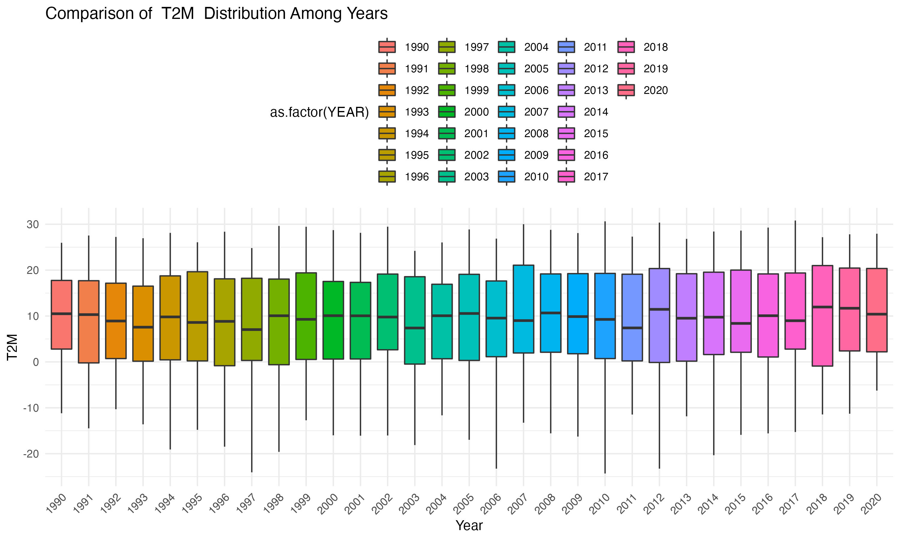

# Case Study of Climate Change on Migrations

## Getting the data

First, install the required packages by running
``` r
install.packages(c("shiny", "leaflet", "nasapower", "glue", "dplyr"))
```
TO BE CONTINUED...


